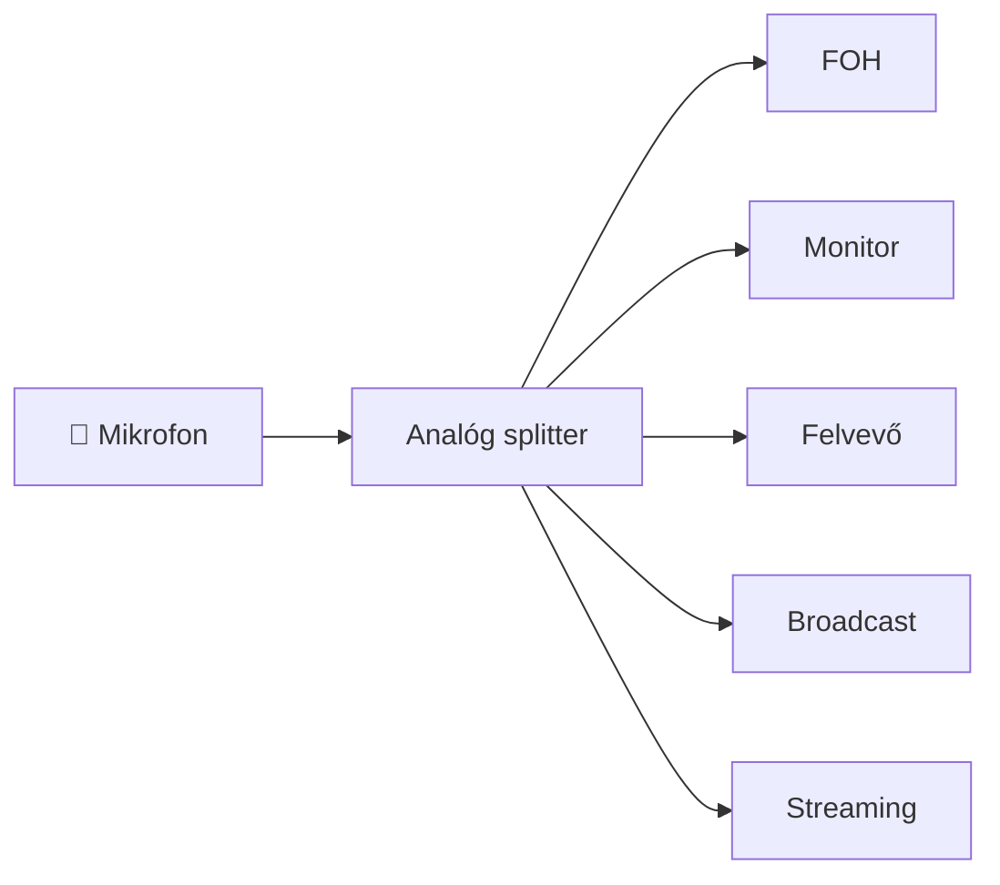

# 1. Mi a Dante?

## A fejezet célja

A Dante-ról sok helyen úgy beszélnek, mint egy professzionális audióhálózati
technológiáról. Ez a meghatározás helyes, de önmagában nagyon keveset mond.

Ahhoz, hogy valóban megértsük a Dante működését, először azt kell
megértenünk, milyen problémák vezettek a megszületéséhez.

Ez a fejezet ezért nem egy termékbemutató.

Sokkal inkább egy mérnöki gondolatmenet.

A fejezet végére meg fogod érteni:

- milyen korlátai voltak az analóg rendszereknek;
- miért nem oldotta meg önmagában a digitális audió ezeket a problémákat;
- miért nem elegendő egyszerűen "hangot küldeni Etherneten";
- hogyan született meg az Audio over IP;
- miért vált a Dante az iparág egyik meghatározó technológiájává.

---

# 1.1 Egy koncert, amelyet senki sem szeretne bekábelezni

Képzeljünk el egy nagyszabású szabadtéri koncertet.

A színpadon dolgozik egy teljes zenekar:

- dobfelszerelés több mikrofonnal;
- basszusgitár;
- két elektromos gitár;
- billentyűs hangszerek;
- fúvósszekció;
- vokalisták;
- főénekes.

Ehhez kapcsolódnak még:

- vezeték nélküli mikrofonok;
- in-ear monitor rendszerek;
- színpadi monitorok;
- felvevő rendszer;
- televíziós közvetítés;
- streaming rendszer.

A hangmérnök azonban nem a színpad mellett dolgozik.

A keverőállás – az úgynevezett **Front of House (FOH)** – gyakran
50–100 méterre található a színpadtól.

A kérdés egyszerűnek tűnik.

**Hogyan jut el minden mikrofon jele a keverőig?**

## A klasszikus megoldás

Évtizedeken keresztül a válasz ugyanaz volt.

Kábelekkel.

Minden egyes mikrofon külön analóg vezetéken kapcsolódott a keverőhöz.

Nagy rendszereknél a különálló kábeleket egyetlen vastag
**multicore kábelkötegbe** fogták össze.

Egy 48 vagy 64 csatornás multicore nem csupán hosszú.

Nehéz is.

Telepítése több ember munkáját igényli, javítása időigényes,
szállítása költséges.

Mindezek ellenére hosszú időn keresztül ez jelentette az iparági szabványt.

---

## Az analóg rendszer előnye

Érdemes megjegyezni, hogy az analóg kábelezés nem "rossz" technológia.

Éppen ellenkezőleg.

Rendkívül egyszerű.

Ha egy mikrofon jele nem érkezik meg a keverőbe, a hibakeresés sokszor
egy multiméterrel és némi rutinnal percek alatt elvégezhető.

Kevés a rejtett összetevő.

Kevés a szoftver.

Kevés a konfiguráció.

A rendszer működése szinte teljes egészében látható.

Ez az egyszerűség az analóg rendszerek egyik legnagyobb erőssége.

---

## A méretnövekedés problémája

A problémák akkor jelentkeztek, amikor a rendszerek mérete növekedni kezdett.

Vegyünk példának egy közepes méretű színházat.

| Jel típusa | Darabszám |
|------------|----------:|
| Mikrofon | 48 |
| Hangszerek | 24 |
| Monitor visszatérők | 16 |
| Effektek | 8 |
| Tartalék csatornák | 16 |

Összesen:

**112 különálló analóg jelút.**

Minden jelhez:

- kábel;
- csatlakozó;
- forrasztás;
- patch pont;
- hibalehetőség.

A rendszer komplexitása közel lineárisan nő a csatornák számával.

---

> ### Mérnöki megjegyzés
>
> Az analóg korszakban a kábelezés gyakran nem pusztán költségtényező volt,
> hanem maga jelentette a rendszer fizikai korlátját.
> Egy új mikrofon hozzáadása sokszor nem technikai, hanem logisztikai feladat
> volt: új kábelre, új patchpontra és gyakran új multicore kapacitásra volt
> szükség.

---

## Egy gondolatkísérlet

Képzeljük el, hogy ugyanazt az énekmikrofont egyszerre szeretnénk eljuttatni

- a FOH keverőhöz;
- a monitor keverőhöz;
- a felvevő rendszerhez;
- a televíziós közvetítéshez;
- egy streaming számítógéphez.

Analóg rendszerben ez nem egyetlen kapcsolat.

Hanem több.

A splitterek kiváló eszközök.

De minden újabb ág:

- növeli a költséget;
- növeli a kábelek számát;
- növeli a hibalehetőségeket.

---

## A valódi kérdés

Ezen a ponton egy mérnök óhatatlanul felteszi a következő kérdést:

> Ha a számítógépes hálózatok képesek másodpercenként gigabájtnyi adatot
> továbbítani, miért ne lehetne ugyanezen a hálózaton professzionális
> hangot is továbbítani?

Ez a kérdés első látásra egyszerűnek tűnik.

A válasz azonban sokkal összetettebb.

A hang ugyanis **nem akármilyen adat**.

És éppen ez az a felismerés, amely végül elvezetett a Dante megszületéséhez