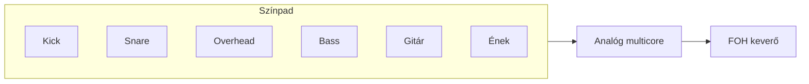
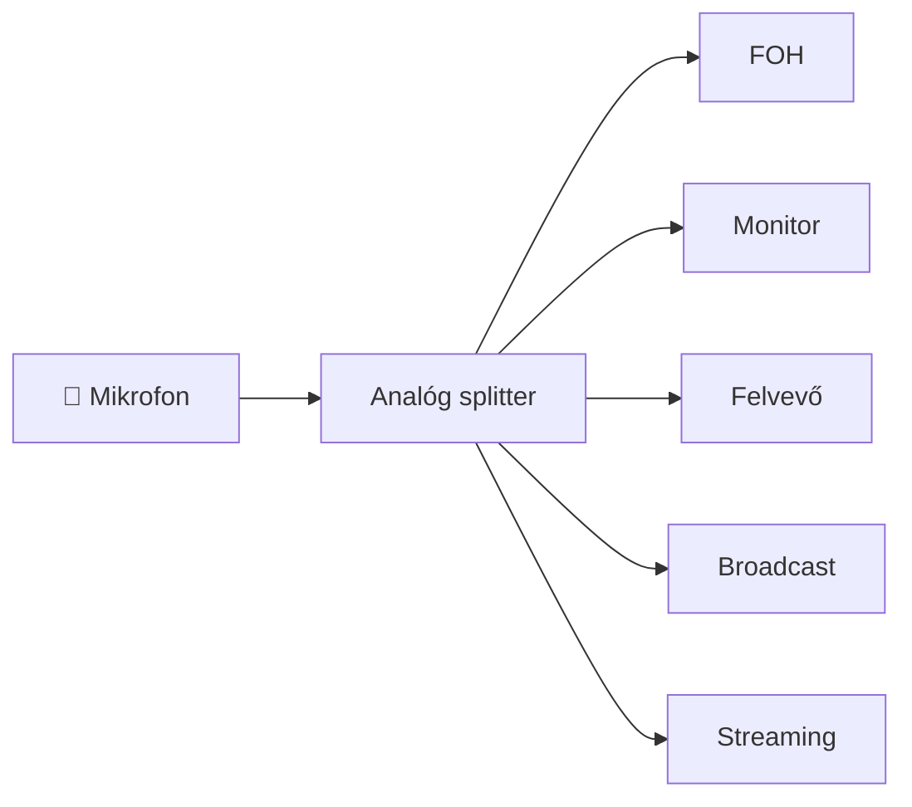
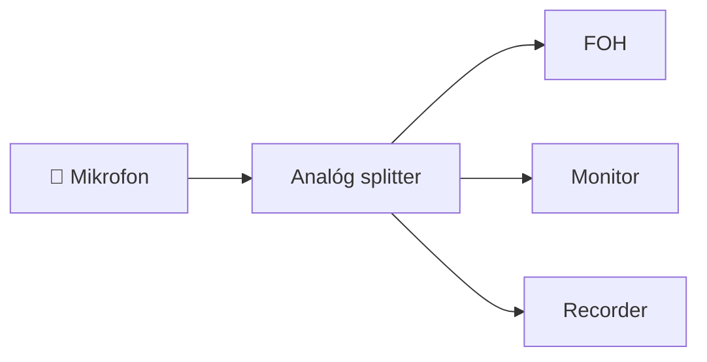
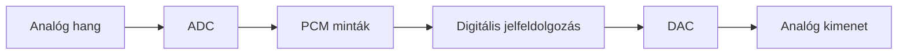
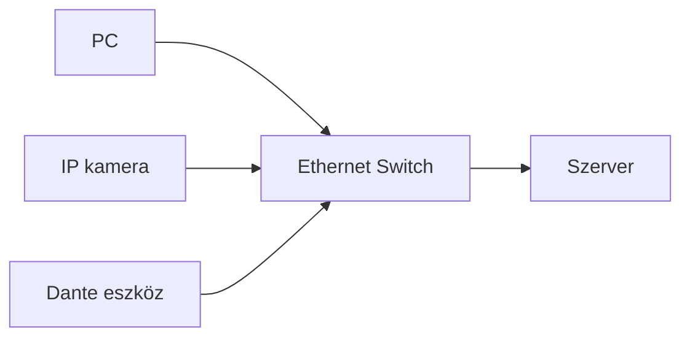
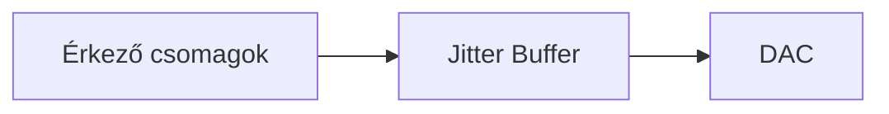
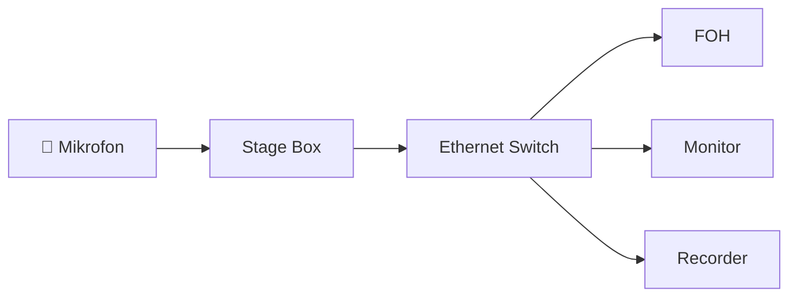
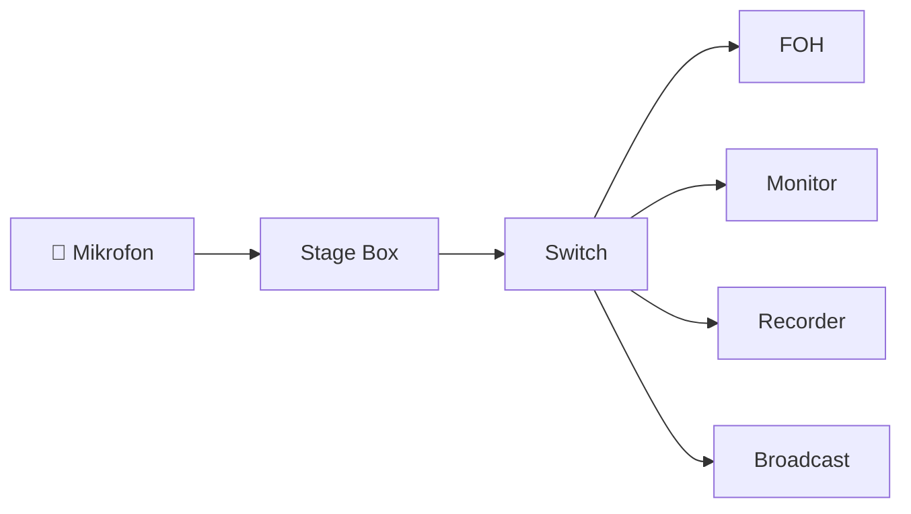

# 1. Mi a Dante?

## A fejezet célja

A Dante-ról sok helyen úgy beszélnek, mint egy professzionális audióhálózati
technológiáról. Ez a meghatározás helyes, de önmagában nagyon keveset mond.

Ahhoz, hogy valóban megértsük a Dante működését, először azt kell
megértenünk, milyen problémák vezettek a megszületéséhez.

Ez a fejezet ezért nem egy termékbemutató.

Sokkal inkább egy mérnöki gondolatmenet.

A fejezet végére meg fogod érteni:

- milyen korlátai voltak az analóg rendszereknek;
- miért nem oldotta meg önmagában a digitális audió ezeket a problémákat;
- miért nem elegendő egyszerűen "hangot küldeni Etherneten";
- hogyan született meg az Audio over IP;
- miért vált a Dante az iparág egyik meghatározó technológiájává.

---

# 1.1 Egy koncert, amelyet senki sem szeretne bekábelezni

Képzeljünk el egy nagyszabású szabadtéri koncertet.

A színpadon dolgozik egy teljes zenekar:

- dobfelszerelés több mikrofonnal;
- basszusgitár;
- két elektromos gitár;
- billentyűs hangszerek;
- fúvósszekció;
- vokalisták;
- főénekes.

Ehhez kapcsolódnak még:

- vezeték nélküli mikrofonok;
- in-ear monitor rendszerek;
- színpadi monitorok;
- felvevő rendszer;
- televíziós közvetítés;
- streaming rendszer.

A hangmérnök azonban nem a színpad mellett dolgozik.

A keverőállás – az úgynevezett **Front of House (FOH)** – gyakran
50–100 méterre található a színpadtól.

A kérdés egyszerűnek tűnik.

**Hogyan jut el minden mikrofon jele a keverőig?**

## A klasszikus megoldás

Évtizedeken keresztül a válasz ugyanaz volt.

Kábelekkel.

Minden egyes mikrofon külön analóg vezetéken kapcsolódott a keverőhöz.



Nagy rendszereknél a különálló kábeleket egyetlen vastag
**multicore kábelkötegbe** fogták össze.

Egy 48 vagy 64 csatornás multicore nem csupán hosszú.

Nehéz is.

Telepítése több ember munkáját igényli, javítása időigényes,
szállítása költséges.

Mindezek ellenére hosszú időn keresztül ez jelentette az iparági szabványt.

---

## Az analóg rendszer előnye

Érdemes megjegyezni, hogy az analóg kábelezés nem "rossz" technológia.

Éppen ellenkezőleg.

Rendkívül egyszerű.

Ha egy mikrofon jele nem érkezik meg a keverőbe, a hibakeresés sokszor
egy multiméterrel és némi rutinnal percek alatt elvégezhető.

Kevés a rejtett összetevő.

Kevés a szoftver.

Kevés a konfiguráció.

A rendszer működése szinte teljes egészében látható.

Ez az egyszerűség az analóg rendszerek egyik legnagyobb erőssége.

---

## A méretnövekedés problémája

A problémák akkor jelentkeztek, amikor a rendszerek mérete növekedni kezdett.

Vegyünk példának egy közepes méretű színházat.

| Jel típusa | Darabszám |
|------------|----------:|
| Mikrofon | 48 |
| Hangszerek | 24 |
| Monitor visszatérők | 16 |
| Effektek | 8 |
| Tartalék csatornák | 16 |

Összesen:

**112 különálló analóg jelút.**

Minden jelhez:

- kábel;
- csatlakozó;
- forrasztás;
- patch pont;
- hibalehetőség.

A rendszer komplexitása közel lineárisan nő a csatornák számával.

---

> ### Mérnöki megjegyzés
>
> Az analóg korszakban a kábelezés gyakran nem pusztán költségtényező volt,
> hanem maga jelentette a rendszer fizikai korlátját.
> Egy új mikrofon hozzáadása sokszor nem technikai, hanem logisztikai feladat
> volt: új kábelre, új patchpontra és gyakran új multicore kapacitásra volt
> szükség.

---

## Egy gondolatkísérlet

Képzeljük el, hogy ugyanazt az énekmikrofont egyszerre szeretnénk eljuttatni

- a FOH keverőhöz;
- a monitor keverőhöz;
- a felvevő rendszerhez;
- a televíziós közvetítéshez;
- egy streaming számítógéphez.

Analóg rendszerben ez nem egyetlen kapcsolat.

Hanem több.



A splitterek kiváló eszközök.

De minden újabb ág:

- növeli a költséget;
- növeli a kábelek számát;
- növeli a hibalehetőségeket.

---

## A valódi kérdés

Ezen a ponton egy mérnök óhatatlanul felteszi a következő kérdést:

> Ha a számítógépes hálózatok képesek másodpercenként gigabájtnyi adatot
> továbbítani, miért ne lehetne ugyanezen a hálózaton professzionális
> hangot is továbbítani?

Ez a kérdés első látásra egyszerűnek tűnik.

A válasz azonban sokkal összetettebb.

A hang ugyanis **nem akármilyen adat**.

És éppen ez az a felismerés, amely végül elvezetett a Dante megszületéséhez
## 1.2 Miért nem működik jól az analóg világ?

Az analóg hangtechnika több mint fél évszázadon keresztül szolgálta ki a professzionális audióipart. Koncertek, színházak, televíziós stúdiók és rádiók ezrei működtek analóg kábelezéssel, és a mai napig számos rendszerben találkozhatunk vele.

Éppen ezért fontos leszögezni, hogy az analóg technológia nem vált használhatatlanná. Számos alkalmazásban ma is kiváló választás.

A kérdés nem az, hogy az analóg rendszerek működnek-e.

A kérdés az, hogy **hogyan viselkednek, amikor a rendszer mérete többszörösére nő.**

---

### A skálázhatóság problémája

Vegyünk két példát.

Az első egy kisebb rendezvény.

| Eszköz | Darabszám |
|--------|----------:|
| Mikrofon | 8 |
| DI Box | 2 |
| Monitor | 2 |

Ebben a rendszerben az analóg kábelezés egyszerű, áttekinthető és költséghatékony.

Most nézzünk meg egy nagyobb koncertet.

| Eszköz | Darabszám |
|--------|----------:|
| Mikrofon | 64 |
| Hangszer | 24 |
| Vezeték nélküli vevő | 16 |
| Monitor út | 24 |
| In-ear rendszer | 24 |
| Broadcast feed | 32 |
| Felvételi csatorna | 64 |

Ebben a rendszerben már több száz analóg jel mozog egyszerre.

Minden egyes új csatorna:

- új csatlakozót jelent;
- új kábelt jelent;
- új hibalehetőséget jelent;
- nagyobb telepítési időt jelent.

A rendszer méretének növekedésével nemcsak a kábelek száma nő, hanem a hibák valószínűsége is.

---

### A fizikai korlát

Az analóg jel egyik sajátossága, hogy **minden kapcsolatnak saját fizikai vezeték szükséges**.

Ha ugyanazt a mikrofonjelet három különböző eszköz szeretné használni, akkor három fizikai kapcsolatot kell kialakítani.



A kapcsolatokat nem lehet "megosztani" úgy, mint egy számítógépes hálózatban.

Minden új útvonal további hardvert igényel.

---

### Tömeg és logisztika

Egy professzionális multicore kábel nem csupán hosszú.

Nehéz is.

Egy 64 csatornás, 75 méteres analóg multicore tömege könnyen meghaladhatja az 50 kilogrammot.

Ennek következményei:

- szállítási költség;
- telepítési idő;
- nagyobb fizikai terhelés;
- több munkaerő.

A kábelek sérülése sem ritka.

Egy megtört vagy megszakadt érpár sokszor csak a helyszínen derül ki.

---

> ### Mérnöki megjegyzés
>
> Nagy rendezvényeken a kábelmenedzsment önálló feladatkör. Egy rosszul megtervezett kábelnyomvonal nemcsak a telepítési időt növeli, hanem balesetveszélyt is jelenthet.

---

### A földhurkok problémája

Az analóg rendszerek egyik legismertebb hibaforrása a földhurok.

Egyszerűsítve akkor alakul ki, amikor két vagy több eszköz földpotenciálja között kis feszültségkülönbség jön létre, és a kiegyenlítő áram a jelkábeleken keresztül folyik.

Ennek tipikus következménye:

- 50 Hz-es brumm;
- 100 Hz-es felharmonikusok;
- zavaró zaj.

A jelenség különösen gyakori:

- nagy épületekben;
- fesztiválokon;
- külön tápköröket használó rendszerekben.

Ezért találkozhatunk olyan eszközökkel, mint:

- DI Box;
- Ground Lift kapcsoló;
- leválasztó transzformátor.

Ezek nem a rendszer kényelmét szolgálják.

Hanem egy meglévő fizikai probléma kezelésére szolgálnak.

---

### Elektromágneses zavarok

Minden analóg vezeték antennaként viselkedik.

Minél hosszabb a kábel,

annál nagyobb az esély arra, hogy külső elektromágneses zavarokat vesz fel.

Lehetséges zavarforrások:

- dimmerek;
- villanymotorok;
- LED tápegységek;
- rádióadók;
- nagy teljesítményű tápkábelek.

Ezért olyan fontos:

- a szimmetrikus jelátvitel;
- a megfelelő árnyékolás;
- a helyes kábelvezetés.

---

### Patch panelek

Nagy rendszerekben az analóg jelek ritkán jutnak közvetlenül A pontból B pontba.

Gyakori, hogy több patch panelen is keresztülhaladnak.

```text
Mikrofon
      │
      ▼
Stage Box
      │
      ▼
Patch Panel
      │
      ▼
Multicore
      │
      ▼
FOH Patch
      │
      ▼
Keverő
```

Minden további csatlakozás:

- növeli az átmeneti ellenállást;
- növeli a meghibásodás lehetőségét;
- növeli a hibakeresés idejét.

---

### A rugalmasság hiánya

Tegyük fel, hogy a koncert kezdete előtt tíz perccel a rendező azt kéri:

> „A 12-es mikrofont küldjük át a broadcast keverőbe is.”

Analóg rendszerben ez gyakran azt jelenti, hogy:

- új patch kábelre van szükség;
- új splitterre van szükség;
- fizikailag át kell kábelezni a rendszert.

Ez időigényes.

És minden fizikai beavatkozás növeli a hibázás lehetőségét.

---

### Összefoglalás

Az analóg technológia hosszú időn keresztül kiválóan szolgálta a professzionális audiót.

A problémák nem az analóg jelátvitelből fakadtak, hanem abból, hogy a modern rendszerek mérete és összetettsége olyan szintre nőtt, ahol a kizárólag fizikai kábelezésre épülő architektúra egyre nehezebben volt kezelhető.

Ez a felismerés vezetett el a digitális audió következő fejlődési lépcsőjéhez.

A következő fejezetben azt vizsgáljuk meg, hogy a digitális keverőpultok és a digitális jelátvitel miért jelentettek előrelépést, és miért nem oldották meg önmagukban a hálózati audió problémáját.

## 1.3 A digitális audió önmagában nem oldotta meg a problémát

Az 1980-as évektől kezdve a professzionális hangtechnika fokozatosan áttért a digitális jelfeldolgozásra.

Megjelentek a digitális keverőpultok, a digitális effektprocesszorok, a digitális hangrögzítők és később a teljesen digitális jelfeldolgozó rendszerek.

Sokan úgy gondolták, hogy ezzel az analóg korszak problémái megszűnnek.

A valóság azonban ennél jóval összetettebb volt.

---

### Mit jelentett a digitalizáció?

A digitalizáció elsődleges célja nem a hálózati kommunikáció volt.

A cél a jel minőségének megőrzése volt.

Egy analóg hangjel a mikrofon után egy analóg-digitális átalakítóba (ADC) kerül, ahol meghatározott időközönként mintát vesznek belőle.

Az így keletkező számsor már digitális adatként dolgozható fel.



A digitális feldolgozás számos előnyt hozott:

- kisebb torzítás;
- nagyobb dinamikatartomány;
- ismételhető jelfeldolgozás;
- pontos paraméterezhetőség;
- presetek használata;
- automatizálás.

A kábelezés problémája azonban továbbra is megmaradt.

---

### A digitális keverő nem jelent digitális hálózatot

Ez az egyik legfontosabb félreértés.

Egy digitális keverőpult belső működése lehet teljesen digitális, attól még a mikrofonok ugyanúgy analóg kábeleken csatlakoznak hozzá.

A jel útja gyakran így nézett ki:

```text
Mikrofon
     │
Analóg XLR
     │
Stage Box
     │
Multicore
     │
Digitális keverő
```

Látható, hogy a digitalizáció csak a keverőnél kezdődik.

A hosszú kábel továbbra is analóg.

---

### Új problémák jelentek meg

A digitális technológia új lehetőségeket adott, de új kihívásokat is hozott.

Megjelentek különböző digitális interfészek:

- AES3 (AES/EBU)
- S/PDIF
- ADAT
- MADI

Mindegyik kiváló technológia volt a maga területén.

Viszont egyik sem oldotta meg teljes egészében a nagy rendszerek összekapcsolását.

---

### A MADI példája

A MADI (Multichannel Audio Digital Interface) sokáig a professzionális digitális audió egyik meghatározó szabványa volt.

Legnagyobb előnye, hogy egyetlen kábelen több tucat audiócsatorna továbbítására képes.

Ez óriási előrelépést jelentett az analóg multicore kábelekhez képest.


Ez azonban továbbra is pont-pont kapcsolat.

A MADI nem hálózat.

Ha egy harmadik eszközt is szeretnénk bekötni, új kapcsolatot kell kialakítani.

---

### A pont–pont kapcsolatok korlátai

Tegyük fel, hogy három digitális keverő dolgozik ugyanabban a rendszerben.

- FOH
- Monitor
- Broadcast

Mindháromnak szüksége van ugyanazokra a mikrofonokra.

Pont–pont kapcsolatok esetén az összeköttetések száma gyorsan növekedni kezd.

```text
FOH  ───────── Monitor

  \             /

   \           /

    \         /

     Broadcast
```

Minél több eszköz kerül a rendszerbe, annál bonyolultabb lesz a topológia.

A probléma hasonló ahhoz, mint amit az analóg kábelezésnél láttunk.

Csak most már digitális formában.

---

### A rugalmasság továbbra sem volt megfelelő

A digitális interfészek jelentős része fix kapcsolatokat használ.

Ha egy új eszközt szeretnénk csatlakoztatni,

gyakran:

- új kábel szükséges;
- új interfész szükséges;
- új konfiguráció szükséges.

A rendszer továbbra sem viselkedik úgy, mint egy valódi számítógépes hálózat.

---

> ### Mérnöki megjegyzés
>
> A digitális jelátvitel és a hálózati jelátvitel nem ugyanaz.
>
> Egy digitális összeköttetés attól még lehet teljesen statikus.
>
> A valódi áttörést nem a digitális audió jelentette, hanem az, amikor a digitális audió hálózati adattá vált.

---

### Mi hiányzott?

Ha egy informatikust megkérdezünk, hogyan kötne össze tíz számítógépet, valószínűleg nem tíz külön kábelt húzna minden gép között.

Switch-et használna.

A professzionális audió azonban sokáig nem így működött.

Hiányzott egy olyan technológia,

amely:

- szabványos hálózatot használ;
- egyszerűen bővíthető;
- képes valós időben működni;
- garantálja a pontos időzítést;
- egyszerre sok eszközt képes kiszolgálni.

Ez volt az a pont, ahol az Audio over IP megjelent.

---

### Összefoglalás

A digitális audió forradalmasította a hangfeldolgozást.

A jel minősége jelentősen javult, új lehetőségek nyíltak meg, és megjelentek a nagy csatornaszámú digitális interfészek.

A hálózati gondolkodás azonban még hiányzott.

A következő fejezetben azt vizsgáljuk meg, hogy miért nem elegendő egyszerűen Ethernet-csomagokba tenni a hangot, és milyen műszaki problémákat kellett megoldani ahhoz, hogy megszülethessen az Audio over IP.

## 1.4 Miért nem lehet egyszerűen elküldeni a hangot egy Ethernet hálózaton?

Az előző fejezet végén felmerült egy látszólag egyszerű kérdés.

> Ha egy számítógépes hálózat képes másodpercenként több gigabit adat továbbítására, miért ne küldhetnénk rajta hangot is?

Első pillantásra a válasz kézenfekvőnek tűnik.

A mikrofonból érkező digitális mintákat csomagokba kell tenni, majd Etherneten elküldeni a célállomásra.

A valóságban azonban ez nem működik ilyen egyszerűen.

A hang nem olyan adat, mint egy dokumentum, egy fénykép vagy egy e-mail.

---

### Az informatikai hálózatok célja

A hagyományos adatkommunikáció elsődleges célja az, hogy az adat hibamentesen megérkezzen.

Vegyünk például egy PDF fájlt.

Ha egy csomag elveszik útközben, a hálózati protokollok újraküldik.

A felhasználó ebből semmit sem vesz észre.

Lehet, hogy a fájl letöltése néhány századmásodperccel tovább tart.

Ez általában nem jelent problémát.

A dokumentum végül sértetlenül megérkezik.

---

### A hang teljesen más

Most képzeljünk el egy élő koncertet.

Az énekes megszólal.

A mikrofon jele elindul a keverő felé.

Ha a hálózat úgy döntene, hogy egy elveszett csomagot újraküld,

akkor a hang már régen továbbhaladt.

A hiányzó minta néhány ezredmásodperccel később érkezne meg.

Ekkor már nincs hová beilleszteni.

Az időablak bezárult.

---

> ### Mérnöki megjegyzés
>
> Élő audió esetén nem az a legfontosabb, hogy minden adat megérkezzen.
>
> Sokkal fontosabb, hogy **időben** érkezzen meg.

---

### Egy egyszerű hasonlat

Képzeljünk el egy szimfonikus zenekart.

Ha az ütősök három másodperccel később kezdenek játszani,

nem az a probléma, hogy végül megszólalnak.

Hanem az, hogy rossz időben.

A hálózati audió pontosan ugyanilyen.

Egy későn érkező csomag gyakran értéktelenebb, mint egy elveszett.

---

### Az idő a legfontosabb erőforrás

A professzionális audióban a késleltetés (latency) szigorúan korlátozott.

Egy modern Dante rendszerben a tipikus késleltetés:

| Alkalmazás | Jellemző késleltetés |
|------------|---------------------:|
| Élő hangosítás | 0,25–1 ms |
| Broadcast | 1–5 ms |
| Stúdió | 1–2 ms |

Összehasonlításképpen:

Egy weboldal betöltése esetén a 100–200 ms késleltetés teljesen elfogadható.

Élő audióban ugyanez már használhatatlan lenne.

---

### Mi történik egy Ethernet switchben?

Egy hagyományos switch nem tudja, hogy a rajta áthaladó csomag:

- videó,
- e-mail,
- biztonsági kamera,
- nyomtatási feladat,
- vagy élő audió.

Számára minden Ethernet keret.



A switch alapértelmezés szerint nem tesz különbséget a forgalom között.

Ha torlódás alakul ki,

a csomagok várakozni kezdenek.

Az élő hang számára ez komoly problémát jelent.

---

### A késleltetés még nem minden

Képzeljük el, hogy tíz egymást követő audiócsomag indul el.

Ideális esetben egyenletes időközönként érkeznek meg.

```text
|----|----|----|----|----|----|
```

Valós hálózatban azonban ez inkább így nézhet ki.

```text
|------|-|---------|---|------|
```

Az átlagos késleltetés lehet ugyanaz,

de az egyes csomagok eltérő időben érkeznek.

Ezt nevezzük **jitternek**.

---

### Miért veszélyes a jitter?

A digitális audió folyamatos mintasor.

Ha a minták egyenetlenül érkeznek,

a lejátszó nem tudja pontosan, mikor melyiket kell megszólaltatni.

Ezért minden Audio over IP rendszer puffereket használ.



A puffer kisimítja az érkezési különbségeket.

Ennek azonban ára van.

Növekszik a késleltetés.

A rendszertervezés egyik legfontosabb feladata a megfelelő kompromisszum megtalálása.

---

### Csomagvesztés

A hagyományos adatátvitel során az elveszett csomag újraküldhető.

Élő audióban erre általában nincs idő.

Ezért a rendszernek úgy kell működnie,

hogy a csomagvesztés gyakorlatilag nulla legyen.

Egyetlen elveszett csomag nem feltétlenül hallható.

Több egymást követő elveszett csomag azonban már:

- kattogást;
- recsegést;
- kimaradást;
- torzulást

okozhat.

---

### És még mindig van egy megoldatlan probléma

Tegyük fel,

hogy két különböző Dante eszköz ugyanazt a hangot szeretné egyszerre rögzíteni.

Honnan tudják,

hogy ugyanaz a "pillanat"

mindkettő számára ugyanazt jelenti?

Ehhez már nem elegendő a gyors hálózat.

A rendszer minden résztvevőjének ugyanazt az időt kell ismernie.

Ez vezet el a könyv egyik legfontosabb témájához:

a pontos időszinkronizációhoz.

Erről azonban később, a PTP-ről szóló fejezetben részletesen is szó lesz.

---

### Összefoglalás

Első pillantásra úgy tűnhet, hogy az Audio over IP nem más, mint digitális hang Ethernet-csomagokba csomagolva.

Valójában ennél jóval többről van szó.

Egy professzionális audióhálózatnak egyszerre kell biztosítania:

- rendkívül alacsony késleltetést;
- minimális jittert;
- gyakorlatilag nulla csomagvesztést;
- pontos időszinkronizációt;
- nagy megbízhatóságot.

Ezek azok a követelmények, amelyek miatt a professzionális Audio over IP rendszerek működése jelentősen eltér egy hagyományos számítógépes hálózatétól.

A következő fejezetben megismerjük, hogyan született meg az Audio over IP koncepciója, és milyen különböző megközelítések alakultak ki, mielőtt a Dante iparági szabvánnyá vált.

## 1.5 Az Audio over IP megszületése

Az előző fejezetekben három fontos felismeréshez jutottunk.

Az analóg rendszerek megbízhatóak voltak, de nagy rendszerekben egyre nehezebben voltak bővíthetők és üzemeltethetők.

A digitális audió jelentősen javította a hangminőséget és a jelfeldolgozás lehetőségeit, de a pont–pont kapcsolatok továbbra is megmaradtak.

A szabványos számítógépes hálózatok rendkívül rugalmasak voltak, ugyanakkor önmagukban nem voltak alkalmasak valós idejű professzionális audió továbbítására.

Felmerült tehát egy új kérdés.

> Lehetséges-e a professzionális hangot ugyanazon az Ethernet hálózaton továbbítani, amelyet egyébként számítógépek, szerverek és egyéb informatikai eszközök is használnak?

Erre a kérdésre adott válasz vezetett az Audio over IP technológiák megszületéséhez.

---

### Mit jelent az Audio over IP?

Az Audio over IP (röviden AoIP) olyan technológiák összefoglaló neve, amelyek digitális hangot továbbítanak IP-alapú számítógépes hálózatokon.

Fontos hangsúlyozni, hogy az Audio over IP nem egyetlen szabvány vagy egyetlen gyártó terméke.

Inkább egy gyűjtőfogalom.

Ahogyan az "autó" sem jelent egyetlen márkát, úgy az Audio over IP sem jelent egyetlen technológiát.

Számos különböző rendszer tartozik ide.

---

### Az alapötlet

Az Audio over IP egyik legfontosabb felismerése a következő volt.

Nem külön audiókábeleket kell építeni.

Nem speciális infrastruktúrát kell telepíteni.

Hanem ugyanazt az Ethernet hálózatot kell használni, amely már egyébként is rendelkezésre áll.



Ebben a rendszerben a mikrofon jele egyszer kerül be a hálózatba.

Ezután tetszőleges számú jogosult eszköz felhasználhatja ugyanazt az adatfolyamot.

Ez alapvetően új gondolkodásmódot jelentett.

---

### Mi változott?

Analóg rendszerben a kapcsolat jelentette az infrastruktúrát.

Audio over IP rendszerben a hálózat jelenti az infrastruktúrát.

Ez apró különbségnek tűnhet.

Valójában ez az egész technológia alapja.

A rendszer középpontjában már nem a kábel áll.

Hanem a hálózat.

---

### Új lehetőségek

Az Audio over IP megjelenésével számos korábban elképzelhetetlen lehetőség vált mindennapossá.

Például:

- ugyanaz a mikrofon egyszerre több keverőbe küldhető;
- egy új felvevő számítógép csatlakoztatása nem igényel új kábelezést;
- egyszerűvé válik a távoli vezérlés;
- könnyebbé válik a redundancia kialakítása;
- a rendszer rugalmasan bővíthető.

A hangsúly egyre inkább a konfiguráción, és egyre kevésbé a fizikai kábelezésen van.

---

### Nem minden AoIP rendszer egyforma

Az Audio over IP gyors fejlődésével több, egymástól jelentősen eltérő megközelítés is megjelent.

A legismertebbek közé tartoznak:

| Technológia | Elsődleges felhasználás |
|-------------|------------------------|
| Dante | Általános professzionális audió |
| Ravenna | Broadcast és stúdió |
| AES67 | Interoperabilitási szabvány |
| AVB / TSN | Determinisztikus Ethernet |
| Q-LAN | QSC rendszerek |

Mindegyik ugyanarra a problémára keres megoldást.

A megvalósítás azonban eltérő.

---

> ### Mérnöki megjegyzés
>
> Az Audio over IP nem egyetlen technológia.
>
> Sokkal inkább egy mérnöki szemlélet.
>
> A közös cél minden rendszerben ugyanaz:
>
> **megbízható, alacsony késleltetésű audió továbbítása szabványos hálózaton.**

---

### Miért nem lett egyetlen szabvány?

Ez gyakran felmerülő kérdés.

Miért nem alakult ki rögtön egyetlen univerzális megoldás?

A válasz részben történelmi.

Az egyes gyártók eltérő igényekre fejlesztettek rendszereket.

A broadcast világ más követelményeket támasztott, mint az élő hangosítás.

A stúdiók más kompromisszumokat fogadtak el, mint egy stadion vagy egy konferenciaközpont.

Ezért több, egymással párhuzamos technológia fejlődött ki.

---

### Mi tette sikeressé a Dante-t?

A Dante nem azért vált sikeressé, mert elsőként jelent meg.

És nem is azért, mert minden műszaki paraméterében felülmúlta a konkurenseit.

Sikerének egyik legfontosabb oka az volt, hogy a felhasználó számára rendkívül egyszerűvé tette egy összetett technológia használatát.

Automatikus eszközfelismerés.

Automatikus órajel-kezelés.

Egyszerű routing.

Szabványos Ethernet infrastruktúra.

A felhasználó gyakran úgy tudott professzionális Audio over IP rendszert építeni, hogy közben nem kellett mély hálózati ismeretekkel rendelkeznie.

Természetesen a háttérben továbbra is ugyanazok a hálózati alapelvek működtek.

Ez a könyv éppen ezek megértésében kíván segítséget nyújtani.

---

### Összefoglalás

Az Audio over IP megjelenése alapvetően megváltoztatta a professzionális audió rendszerek tervezését.

A hangsúly a fizikai kábelezésről fokozatosan áthelyeződött a hálózati architektúrára.

Ebben a fejlődési folyamatban a Dante vált az egyik legjelentősebb és legszélesebb körben alkalmazott technológiává.

A következő fejezetben részletesebben megvizsgáljuk magát a Dante rendszert, annak alapelveit és legfontosabb építőköveit.

## 1.6 A Dante megszületése

2006-ban az ausztrál Audinate bemutatta azt a technológiát, amelyet ma Dante néven ismerünk.

A Dante célja nem egy újabb digitális audió interfész létrehozása volt.

A cél egy olyan rendszer megalkotása volt, amely lehetővé teszi professzionális audió továbbítását szabványos Ethernet hálózatokon úgy, hogy közben megfelel az élő hangosítás, a broadcast és a stúdiók rendkívül szigorú követelményeinek.

A Dante megjelenésével először vált lehetővé, hogy egyetlen Ethernet infrastruktúrán:

- több száz audiócsatorna működjön párhuzamosan;
- az eszközök automatikusan felismerjék egymást;
- a routing szoftveresen történjen;
- a rendszer alacsony késleltetéssel működjön;
- mindez a felhasználó számára egyszerű maradjon.

---

### Mi volt az alapötlet?

A Dante legfontosabb felismerése egyszerű.

Ne a hangrendszer legyen külön infrastruktúra.

Használjuk ugyanazt a hálózatot, amelyet az informatikai világ már évtizedek óta fejleszt.

Ez azt jelenti, hogy egy professzionális hangrendszer alapját ugyanazok a szabványos komponensek képezhetik, mint egy vállalati hálózatét.

- Ethernet kábelek;
- szabványos switch-ek;
- IP protokoll;
- redundáns hálózatok;
- optikai gerinchálózat.

A különbséget már nem a kábelek jelentik.

Hanem az a szoftveres réteg, amely képes a hangot valós időben kezelni.

---

### A Dante működése magas szinten

Nagyon leegyszerűsítve egy Dante rendszer működése a következő.


Első pillantásra ez nem tűnik különösebben bonyolultnak.

A háttérben azonban számos összetett folyamat zajlik egyszerre.

A rendszernek például:

- fel kell ismernie az összes Dante eszközt;
- ki kell választania a közös órajelet;
- szinkronban kell tartania a mintavételezést;
- biztosítania kell a megfelelő késleltetést;
- kezelnie kell a hálózati forgalmat;
- szükség esetén redundáns útvonalakat kell használnia.

A felhasználó ebből gyakran csak annyit érzékel, hogy egy új eszköz néhány másodperc múlva megjelenik a Dante Controllerben.

---

### A Dante nem csak audiót továbbít

Sokan úgy gondolnak a Dante-ra, mint "hang Etherneten".

Valójában ennél többről van szó.

A hálózaton egyszerre többféle információ áramlik.

Például:

- audió minták;
- órajel-információk;
- eszközfelderítés;
- konfigurációs adatok;
- állapotinformációk.

Ezért egy Dante hálózatban egyszerre több különböző hálózati protokoll működik együtt.

Ezeket a könyv későbbi fejezeteiben részletesen megvizsgáljuk.

---

### A Dante egyik legnagyobb előnye

Vegyük ugyanazt a példát, mint korábban.

Egy mikrofont egyszerre szeretnénk használni:

- a FOH keverőben;
- a monitor keverőben;
- egy felvevő számítógépen;
- a broadcast rendszerben.

Analóg rendszerben ehhez splitterre volt szükség.

Dante esetén elegendő egyszer létrehozni a kapcsolatot a hálózaton.



A fizikai kábelezés változatlan marad.

Csupán a hálózati kapcsolatok változnak.

---

### Mitől lett ennyire sikeres?

A Dante sikerének egyik kulcsa az volt, hogy a rendkívül összetett hálózati működést nagyrészt elrejtette a felhasználó elől.

Egy kezdő felhasználó gyakran úgy tud működő rendszert létrehozni, hogy közben nem ismeri:

- az ARP működését;
- a multicast kezelését;
- a Precision Time Protocol részleteit;
- a QoS működését.

Ez óriási előny volt.

Ugyanakkor nagy rendszereknél ezeknek az ismereteknek a hiánya könnyen hibákhoz vezethet.

Ezért épül fel ez a könyv fordított logikával.

Először megértjük a működést.

Csak ezután tanuljuk meg a Dante Controller használatát.

---

### Mi történik valójában?

A legtöbb felhasználó úgy látja a Dante rendszert, mint egy virtuális patch panelt.

Valójában azonban ennél jóval több történik.

Egyetlen másodperc alatt:

- több tízezer Ethernet keret halad át a hálózaton;
- folyamatos időszinkronizáció zajlik;
- minden eszköz saját pufferét kezeli;
- a switch-ek prioritások alapján továbbítják a csomagokat;
- a vevőeszközök folyamatosan korrigálják saját órájukat.

Mindez úgy történik, hogy a felhasználó ebből semmit sem vesz észre.

És pontosan ez egy jól működő Dante rendszer egyik legnagyobb erőssége.

---

### Összefoglalás

A Dante nem egyszerűen egy digitális audió interfész.

Nem csupán egy hálózati protokoll.

Hanem egy olyan teljes rendszer, amely képes professzionális audiót továbbítani szabványos IP hálózatokon, miközben biztosítja a valós idejű működéshez szükséges időzítést, megbízhatóságot és rugalmasságot.

A következő fejezetben megvizsgáljuk, hogyan épül fel egy tipikus Dante rendszer, milyen eszközök alkotják, és milyen szerepet töltenek be az egyes komponensek.

## 1.7 Hogyan gondolkodik egy Dante rendszer?

Az előző fejezetekben megismertük azokat a problémákat, amelyek az analóg és a korai digitális audiórendszereket jellemezték.

Láttuk, hogy a professzionális Audio over IP nem egyszerűen egy újabb kábelezési megoldás, hanem egy teljesen új szemlélet.

Most érdemes egy pillanatra megállni.

Nem azért, hogy újabb technológiát tanuljunk.

Hanem azért, hogy megértsük, **hogyan "gondolkodik" egy Dante rendszer.**

---

### Az analóg gondolkodás

Analóg rendszerben a kapcsolat maga a kábel.

Ha egy mikrofont össze szeretnénk kötni egy keverővel, akkor közöttük fizikai vezeték jön létre.

```
Mikrofon
     │
     │
     ▼
Keverő
```

Ha ugyanazt a mikrofont egy másik keverőnek is használni kell, akkor újabb fizikai kapcsolat szükséges.

Ebben a világban a kábel jelenti a kapcsolatot.

---

### A hálózati gondolkodás

Egy Dante rendszer teljesen másként működik.

A kábel már nem két eszközt köt össze.

A kábel egy közös hálózat része.

```
               Switch
           ┌────┼────┐
           │    │    │
         FOH  Monitor Recorder
           │
       Stage Box
           │
      Mikrofon
```

Ebben a rendszerben a mikrofon nem "egy keverőhöz csatlakozik".

Hanem **a hálózatra csatlakozik**.

Ez alapvető szemléletváltás.

---

### A hálózat mint közös erőforrás

Egy vállalati számítógépes hálózatban senki sem épít külön Ethernet-kábelt minden egyes számítógép és minden egyes szerver közé.

A hálózat közös infrastruktúra.

Pontosan ugyanez történik a Dante esetében is.

A mikrofon nem azt kérdezi:

> Melyik keverőhöz tartozom?

Hanem azt:

> Melyik hálózat része vagyok?

Ez a különbség első olvasásra apróságnak tűnhet.

Valójában ez választja el a klasszikus hangtechnikát a modern Audio over IP rendszerektől.

---

### A kapcsolat már nem fizikai

Vegyük a következő példát.

Egy új felvevő számítógépet szeretnénk csatlakoztatni a rendszerhez.

Analóg rendszerben ez gyakran azt jelenti, hogy:

- új splitter szükséges;
- új kábelek szükségesek;
- új patch-elés szükséges.

Dante esetén elegendő:

1. csatlakoztatni az új eszközt a hálózathoz;
2. létrehozni a szükséges audiókapcsolatokat.

A fizikai kábelezés változatlan marad.

Csak a konfiguráció változik.

---

### A rendszer folyamatosan dolgozik

Egy Dante hálózat soha nincs "készen".

A háttérben folyamatosan történik:

- eszközfelderítés;
- órajel-szinkronizáció;
- útvonalválasztás;
- pufferkezelés;
- hálózati forgalom figyelése.

A felhasználó ebből általában semmit sem vesz észre.

Ez a jól működő rendszer egyik ismérve.

---

### A könyv szemlélete

Ez a könyv nem arra tanít meg, hogyan kell egy adott menüpontra kattintani.

Arra tanít meg, hogy mi történik **a kattintás után**.

Amikor később egy Dante Controller ablakban létrehozunk egy kapcsolatot, valójában nem egy "vonalat húzunk két eszköz között".

A háttérben:

- hálózati címek kerülnek feloldásra;
- vezérlőüzenetek cserélnek gazdát;
- audiófolyamok jönnek létre;
- időszinkronizáció történik;
- a switch-ek új forgalmi mintázatot kezelnek.

A könyv célja ennek a láthatatlan folyamatnak a megértése.

---

> ### Mérnöki gondolkodás
>
> Egy jó Dante mérnök nem azt kérdezi:
>
> *"Melyik kábel rossz?"*
>
> Hanem azt:
>
> *"A rendszer melyik rétegében jelentkezik a probléma?"*
>
> Ez a két kérdés ugyan hasonlónak tűnik, mégis teljesen eltérő hibakeresési szemléletet tükröz.

---

### Mit viszünk tovább?

A következő fejezetekben fokozatosan lebontjuk a Dante működését.

Megvizsgáljuk:

- hogyan működik a digitális hang;
- hogyan épül fel egy Ethernet keret;
- hogyan működik egy switch;
- hogyan működik az IP;
- hogyan választódik ki a Master Clock;
- hogyan épül fel egy audiófolyam;
- hogyan működik a multicast;
- hogyan biztosítja a QoS a valós idejű működést.

Minden új fejezet ugyanannak a rendszernek egy újabb rétegét tárja fel.

A cél nem csupán a Dante megismerése.

A cél annak megértése, hogy egy modern professzionális audióhálózat hogyan működik a legalsó bitektől egészen a hangszóró membránjáig.

## 1.8 A fejezet legfontosabb gondolatai

Mielőtt továbblépnénk a digitális audió részletes tárgyalására, érdemes néhány percet szánni arra, hogy összefoglaljuk az első fejezet legfontosabb üzeneteit.

Ha az alábbi állításokat megérted, akkor az első fejezet elérte a célját.

### A professzionális audió fejlődése nem egyetlen technológiai ugrás volt

Az analóg rendszereket nem azért váltották fel új megoldások, mert rosszul működtek.

A fejlődést a rendszerek méretének növekedése, a nagyobb rugalmasság iránti igény és az egyre összetettebb produkciók követelményei tették szükségessé.

---

### A digitális audió nem egyenlő a hálózati audióval

Digitális keverő használata önmagában még nem jelent Audio over IP rendszert.

A digitális jelfeldolgozás és a hálózati adatátvitel két különböző problémát old meg.

---

### A hang nem közönséges adat

Egy dokumentum vagy fénykép később is megérkezhet.

Egy élő koncert hangja nem.

A professzionális audió legfontosabb követelménye az idő.

Nem elegendő, hogy az adat megérkezzen.

Az is szükséges, hogy **pontosan akkor érkezzen meg**, amikor annak meg kell történnie.

---

### A hálózat lett az új infrastruktúra

Az Audio over IP legnagyobb újítása nem maga az Ethernet.

Hanem az a szemlélet, hogy a teljes rendszer közös hálózati infrastruktúrára épül.

Ez teszi lehetővé a rugalmas bővíthetőséget és az egyszerű konfigurálhatóságot.

---

### A Dante nem varázslat

A Dante mögött ismert hálózati technológiák működnek.

Ethernet.

IP.

UDP.

Precision Time Protocol.

Multicast.

QoS.

A Dante ezeket úgy kombinálja, hogy a felhasználó számára egyszerű, megbízható és gyors rendszert biztosítson.

---

### A könyv célja

Ez a könyv nem arra tanít meg, hogyan kell használni egy szoftvert.

Arra tanít meg, hogy **mi történik a háttérben**.

Ha ezt megérted, bármely Dante-kompatibilis eszköz működését könnyebben fogod átlátni.

---

## 1.9 Ellenőrző kérdések

Próbálj meg válaszolni a következő kérdésekre anélkül, hogy visszalapoznál.

### Alapfogalmak

1. Miért vált nehezen kezelhetővé az analóg kábelezés nagy rendszerekben?

2. Miért nem oldotta meg önmagában a digitális audió a hálózati problémákat?

3. Mit jelent az Audio over IP?

4. Mi a legfontosabb különbség a digitális audió és a hálózati audió között?

5. Miért fontosabb élő audió esetén az időzítés, mint az újraküldés?

---

### Gondolkodtató kérdések

6. Mi történne, ha egy Dante rendszer TCP protokollt használna audió továbbításra?

7. Miért jelent problémát a jitter még akkor is, ha a csomagok nem vesznek el?

8. Miért nem elegendő egy gyors hálózat professzionális audióhoz?

9. Miért tekinthető a Dante inkább rendszernek, mint egyszerű protokollnak?

10. Milyen előnyöket jelent a hálózati gondolkodás a klasszikus patch paneles megoldásokkal szemben?

---

## 1.10 Labor

### Labor 1 – Gondolkodjunk rendszerintegrátorként

Egy kulturális központ új hangrendszerének tervezésében veszel részt.

A rendszer elemei:

- 32 mikrofon;
- 16 vezeték nélküli mikrofon;
- két digitális keverő;
- egy felvevő számítógép;
- egy streaming munkaállomás;
- két színpadi stage box.

#### Feladat

Papíron vagy rajzolóprogram segítségével készíts két tervet.

Az első legyen hagyományos analóg rendszer.

A második Audio over IP alapú rendszer.

Hasonlítsd össze:

- hány kábelre van szükség;
- hány különálló kapcsolatra van szükség;
- mennyire könnyű új eszközt hozzáadni;
- hogyan történik egy új kapcsolat létrehozása.

A labor célja nem a Dante konfigurálása.

A cél annak felismerése, hogy a két rendszer mögött teljesen eltérő szemlélet áll.

---

## 1.11 Deep Dive

### Miért nem TCP?

Valószínűleg már felmerült benned a kérdés.

Ha a TCP garantálja, hogy minden adat megérkezik,

akkor miért nem ezt használja a Dante?

A válasz röviden:

Mert a TCP megbízhatóságot biztosít.

Az élő audió viszont időzítést igényel.

Egy elveszett TCP csomag újraküldése tökéletes egy dokumentum esetén.

Egy élő koncert közben azonban a későn érkező audióminta már használhatatlan.

Ezért a professzionális Audio over IP rendszerek többsége UDP-alapú adatátvitelt alkalmaz.

A UDP önmagában azonban nem oldja meg a problémát.

Szükség van:

- pontos időszinkronizációra;
- megfelelő pufferkezelésre;
- prioritáskezelésre;
- determinisztikus hálózati működésre.

Ezeket a könyv következő fejezeteiben részletesen megvizsgáljuk.

---

## A következő fejezet

Az első fejezetben megértettük,

**miért volt szükség a Dante megszületésére.**

Most azonban visszalépünk egy szintet.

Mielőtt tovább vizsgálnánk a hálózati audiót, pontosan meg kell értenünk, mi is történik egy analóg hanggal, amikor digitális adattá alakul.

A következő fejezetben ezért a digitális audió alapjaival foglalkozunk.

A könyv egyik legfontosabb alapköve következik.
